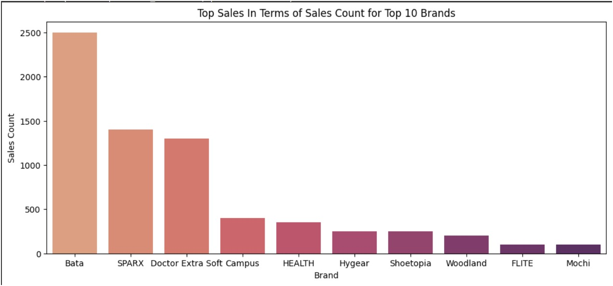
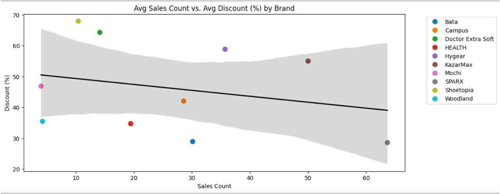
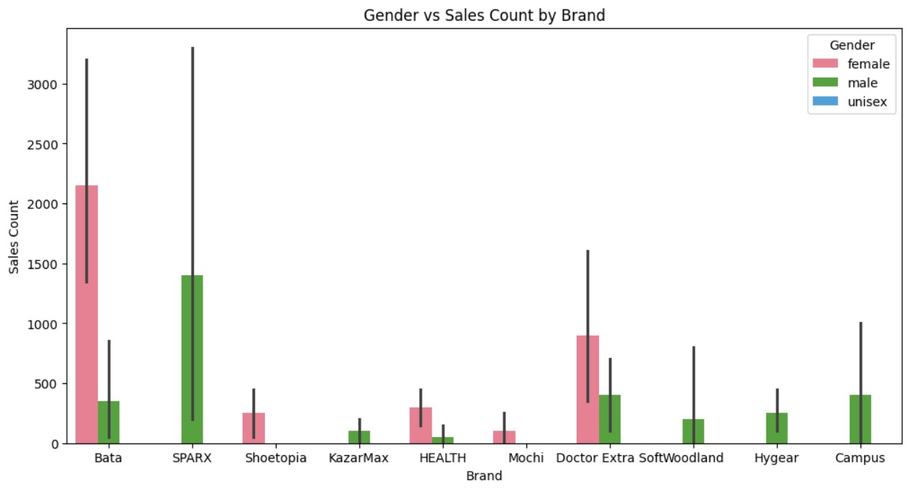
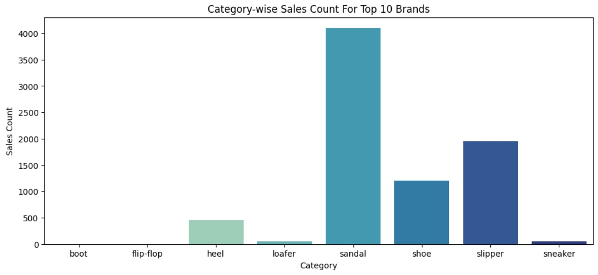
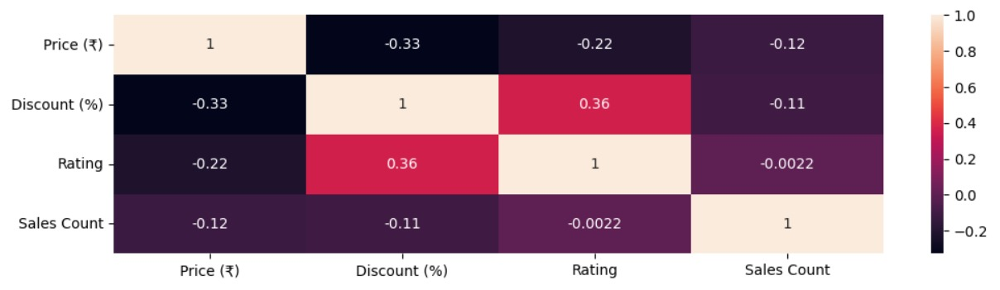

# 🛍️ Amazon Footwear EDA Project

## 📌 Project Title
**Amazon Footwear Analytics: Winning Strategies for New Sellers**

---

## 🧠 Business Problem

A new seller on Amazon needs data-driven advice on which footwear brands and categories to invest in. The goal is to identify the top-performing footwear products based on sales, pricing, discounts, ratings, and gender preferences.

---

## 🎯 Objective

- Identify top-selling footwear brands on Amazon.
- Analyze price, discount, and rating impact on sales.
- Provide actionable insights to help new sellers maximize profits.

---

## 🔍 Use Case

**Market Trend Insights** – Understand brand popularity, pricing strategy, customer ratings, and buying behavior to make better business decisions.

---

## 🧰 Tools & Technologies Used

- **Python Libraries**: `BeautifulSoup`, `Requests`, `Pandas`, `Matplotlib`, `Seaborn`, `CSV`
- **Techniques**: Web Scraping, EDA, Bivariate and Multivariate Analysis
- **Data Source**: [Amazon Footwear](https://www.amazon.in/s?k=footwear)

---

## 📊 Dataset Summary

- **Total Records**: 910  
- **Total Features**: 11  
- **Key Columns**:
  - `Brand`
  - `Gender`
  - `Category`
  - `Price (₹)`
  - `Discount (%)`
  - `Rating`
  - `Sales Count`
  - `Total Sales Amount`
  - `Water Resistance`
  - `Country`

---

## 📈 Exploratory Data Analysis (EDA)

### 🔹 Graph 1: Top 10 Brands by Sales Count

✅ *Insight*: Bata leads, followed by Sparx and Doctor Extra Soft.

---

### 🔹 Graph 2: Average Sales Count vs. Average Discount by Brand

✅ *Insight*: Moderate discounts are more effective than extreme ones.

---

### 🔹 Graph 3: Gender Distribution in Sales

✅ *Insight*: Female footwear contributes 54% of total sales.

---

### 🔹 Graph 4: Category-wise Sales Count

✅ *Insight*: Sandals dominate, followed by slippers and shoes.

---

### 🔹 Graph 5: Correlation Heatmap

✅ *Insight*: Weak correlation between pricing, discounts, ratings, and actual sales count.

---

## ✅ Key Insights

- **Top Brands**: Bata, Sparx, Doctor Extra Soft
- **Best Categories**: Sandals, Slippers, Shoes
- **Sales Factors**:
  - Lower price = more sales
  - Moderate discounts enhance ratings
  - Products rated 4.0+ sell significantly more
- **Gender Targeting**: Focus on male and female-specific products
- **Water Resistance**: Not a priority for customers

---

## 📝 Recommendations for New Sellers

1. Stock **Bata**, **Sparx**, and **Doctor Extra Soft**.
2. Prioritize **Sandals**, **Slippers**, and **Shoes**.
3. Use **competitive pricing** with **moderate discounts**.
4. Focus on **high-rated products** (4.0+).
5. Avoid unisex products—target male and female categories specifically.

